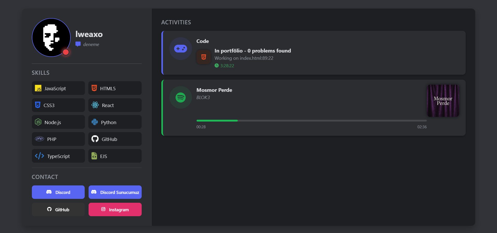

# 👑 Kişisel Portföy Sitesi



## 🌟 Özellikler

- Modern ve şık kraliyet teması
- Responsive tasarım (tüm cihazlarda düzgün görüntülenme)
- Discord entegrasyonu (Lanyard API)
- Sosyal medya bağlantıları
- Yetenekler bölümü
- Özelleştirilebilir arayüz

## 🛠️ Kurulum

1. Projeyi klonlayın:
```bash
git clone https://github.com/sizin-kullanici-adiniz/sizin-repo.git
cd sizin-repo
```

2. Gerekli dosyaları ekleyin:
- `index.html`
- `style.css`
- `script.js`

3. Tarayıcıda açın:
```bash
start index.html  # Windows
open index.html   # Mac
xdg-open index.html  # Linux
```

## 🎨 Özelleştirme

### 🔧 Temel Ayarlar
```javascript
// script.js içinde
const USER_ID = "DISCORD_IDNIZ"; // Discord ID'niz
```

```html
<div class="social-buttons">
  <!-- DEĞİŞTİR: Discord profil linkinizi buraya ekleyin -->
  <button class="contact-btn discord" data-url="https://discord.com/users/DISCORD_ID">
    <i class="fab fa-discord"></i>
    <span>Discord Profilim</span>
  </button>
  
  <!-- DEĞİŞTİR: Discord sunucu invite kodunuzu buraya ekleyin -->
  <button class="contact-btn discord-server" data-url="discord.gg/SUNUCU_INVITE">
    <i class="fas fa-users"></i>
    <span>Discord Sunucumuz</span>
  </button>
  
  <!-- DEĞİŞTİR: GitHub profil linkinizi buraya ekleyin -->
  <button class="contact-btn github" data-url="https://github.com/KULLANICI_ADI">
    <i class="fab fa-github"></i>
    <span>GitHub</span>
  </button>
  
  <!-- DEĞİŞTİR: Instagram profil linkinizi buraya ekleyin -->
  <button class="contact-btn instagram" data-url="https://instagram.com/KULLANICI_ADI">
    <i class="fab fa-instagram"></i>
    <span>Instagram</span>
  </button>
</div>
```

### 🎨 Renk Teması
```css
/* style.css içinde */
:root {
  --royal-gold: #FFD700;
  --royal-purple: #800080;
  --dark-bg: #1A1A2E;
}
```

# Dikkat!

- eğer [**Lanyard**](https://discord.gg/lanyard)'ın discord sunucusuna girmez iseniz çalışmaz!

## 🚀 Canlı Demo

[](https://lweaxo-portfolyo.vercel.app/)

## 📜 Lisans

MIT Lisansı - Detaylar için [LICENSE](LICENSE) dosyasına bakın.

---

## 📞 İletişim

[](https://discord.com/users/1015356240492245054)
[](https://instagram.com/lweaxo)

---
